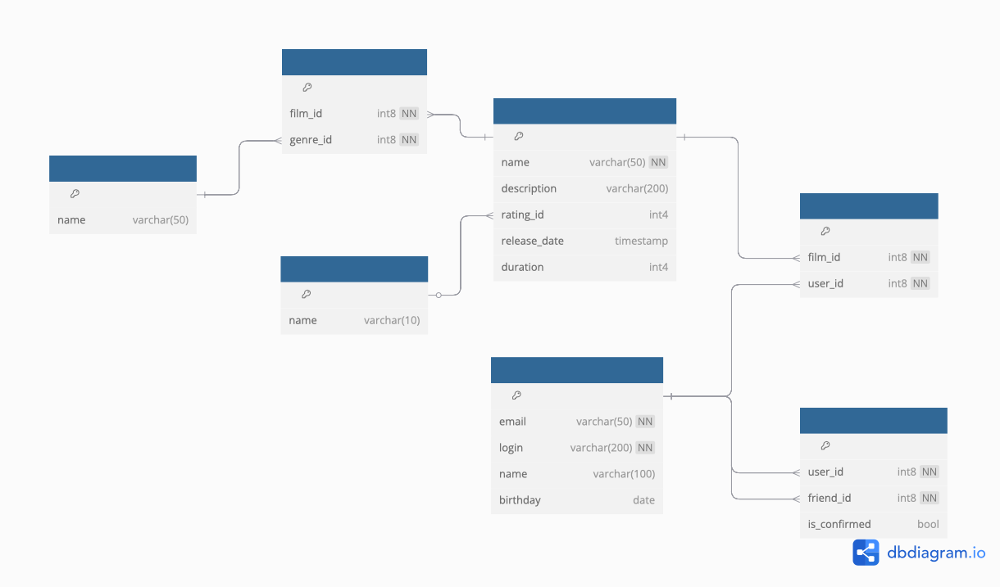

# Filmorate
Учебный проект с курса "Java-разработчик" от Яндекс.Практикума <br/>

### Содержание
- [История изменений](#история-изменений)
- [ER-диаграмма](#er-диаграмма-базы-данных)

## История изменений

- 0.3.1 
    - Спринт 12.2
    - Доработки для хранения данных в БД
    - Разделение архитектуры на слои (репозитории, контроллеры, сервисы)
- 0.3.0
    - Спринт 12.1
    - Добавлена ER-диаграмма будущей базы данных
- 0.2.0
    - Спринт 11.
    - Добавлены сервисы и репозитории.
    - Организовано хранение данных в оперативной памяти.
    - Добавлен функционал для проставления лайков фильмам и добавления пользователей друг друга в друзья (без подтверждения)
    - Расширение тестов
- 0.1.0
    - Спринт 10.
    - Первая версия приложения.
    - Вся реализация находится в контроллерах.
    - Тесты

## ER-диаграмма базы данных



### Описание таблиц
#### films
Для хранения данных о фильмах
- id - PK, идентификатор
- name - Наименование фильма
- description - Описание фильма
- rating_id - FK raitings.id, идентификатор рейтинга
- release_date - Дата выхода
- duration - Продолжительность в минутах
#### genres
Для хранения данных о жанрах
- id - PK, идентификатор
- name - Наименование жанра
#### ratings
Для хранения данных о рейтингах
- id - PK, идентификатор
- name - Наименование рейтинга
#### genres_on_films
Для хранения данных о жанрах
- film_id - Идентификатор фильма
- genre_id - Идентификатор жанра
#### users
Для хранения данных о пользователях
- id - PK, идентификатор
- email - Электронная почта пользователя
- login - Логин пользователя
- name - Имя пользователя
- birthday - День рождения
#### likes_on_films
Для хранения данных о лайках пользователей на фильмы
- film_id - Идентификатор фильма
- user_id - Идентификатор пользователя
#### friends
Для хранения данных о дружбе
- user_id - Идентификатор пользователя
- friend_id - Идентификатор друга

### Примеры запросов
Получить информацию о фильмах, продолжительность которых не превышает 60 минут:
```sql
SELECT f.*
FROM films f
WHERE duration < 60
```

Получить количество лайков на фильм c id = 1:
```sql
SELECT COUNT(user_id)
FROM likes_on_films
WHERE film_id = 1
```

Получить список идентификаторов общих друзей для пользователей с id = 1 и id = 2:
```sql
SELECT friend_id
FROM friends
WHERE user_id = 1
INTERSECT
SELECT friend_id
FROM friends
WHERE user_id = 2
```

