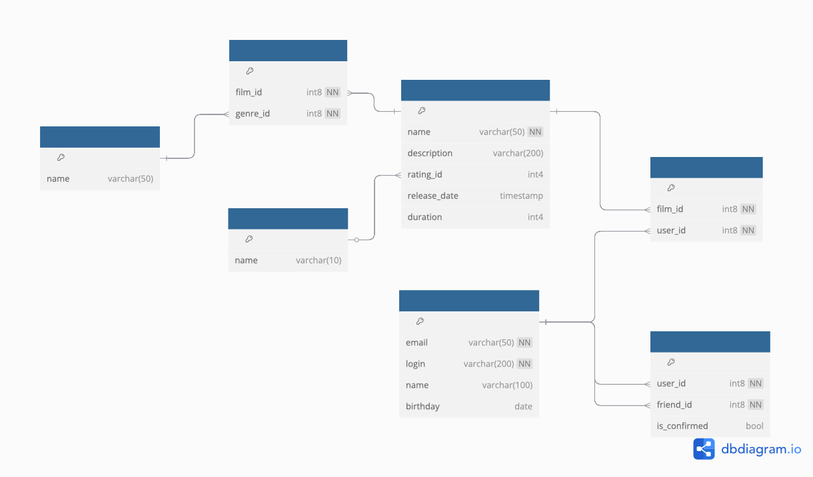

# Filmorate
Учебный проект с курса "Java-разработчик" от Яндекс.Практикума  

### Содержание
- [История изменений](#история-изменений)
- [ER-диаграмма](#er-диаграмма-базы-данных)

## История изменений

- 0.3.0
  - Спринт 12.
  - Добавлена ER-диаграмма будущей базы данных
- 0.2.0
  - Спринт 11.
  - Добавлены сервисы и репозитории.
  - Организовано хранение данных в оперативной памяти.
  - Добавлен функционал для проставления лайков фильмам и добавления пользователей друг друга в друзья (без подтверждения)
  - Расширение тестов
- 0.1.0
  - Спринт 10. 
  - Первая версия приложения.
  - Вся реализация находится в контроллерах.
  - Тесты
  
## ER-диаграмма базы данных
[Ссылка на диаграмму](https://github.com/atrin-git/java-filmorate/blob/AddDatabaseDiagram/)
  

