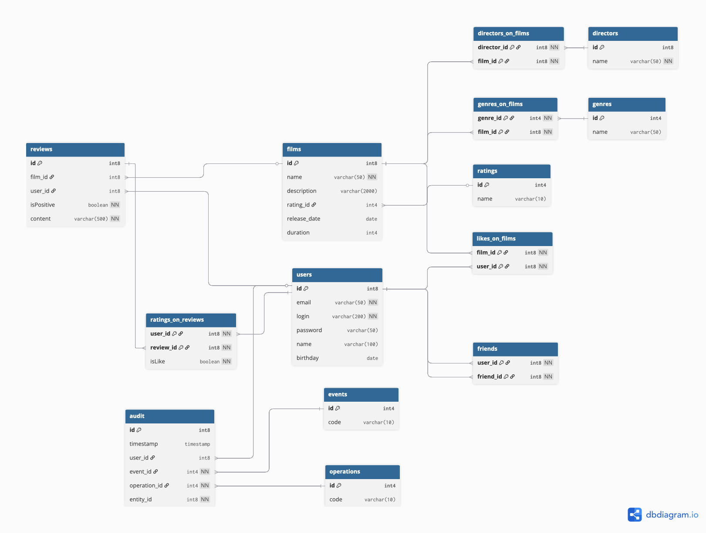

# Filmorate

Учебный проект с курса "Java-разработчик" от Яндекс.Практикума <br/>

### Содержание

- [История изменений](#история-изменений)
- [ER-диаграмма](#er-диаграмма-базы-данных)
    - [Описание таблиц](#Описание-таблиц)
    - [Примеры запросов](#примеры-запросов)

## История изменений

- 0.4.0
    - Спринт 13. Групповой проект
    - Расширена база данных
    - Добавлены фичи на удаление пользователей и фильмов
    - Доработано получение списка популярных фильмов с фильтрацией по годам и жанрам
    - Добавлена функциональность по общим фильмам пользователей
    - Добавлены режиссеры к фильмам
    - Разработан функционал для Отзывов, Поиска и Ленты событий пользователей
- 0.3.1
    - Спринт 12.2
    - Доработки для хранения данных в БД
    - Разделение архитектуры на слои (репозитории, контроллеры, сервисы)
- 0.3.0
    - Спринт 12.1
    - Добавлена ER-диаграмма будущей базы данных
- 0.2.0
    - Спринт 11.
    - Добавлены сервисы и репозитории.
    - Организовано хранение данных в оперативной памяти.
    - Добавлен функционал для проставления лайков фильмам и добавления пользователей друг друга в друзья (без
      подтверждения)
    - Расширение тестов
- 0.1.0
    - Спринт 10.
    - Первая версия приложения.
    - Вся реализация находится в контроллерах.
    - Тесты

## ER-диаграмма базы данных



### Описание таблиц

<details open>
  <summary>films</summary>

Для хранения данных о фильмах

- id - PK, идентификатор
- name - Наименование фильма
- description - Описание фильма
- rating_id - FK raitings.id, идентификатор рейтинга
- release_date - Дата выхода
- duration - Продолжительность в минутах

</details>
<details>
  <summary>genres</summary>

Для хранения данных о жанрах

- id - PK, идентификатор
- name - Наименование жанра

</details>
<details>
  <summary>ratings</summary>

Для хранения данных о рейтингах

- id - PK, идентификатор
- name - Наименование рейтинга

</details>
<details>
  <summary>genres_on_films</summary>

Для хранения данных о жанрах

- film_id - Идентификатор фильма
- genre_id - Идентификатор жанра

</details>
<details>
  <summary>users</summary>

Для хранения данных о пользователях

- id - PK, идентификатор
- email - Электронная почта пользователя
- login - Логин пользователя
- name - Имя пользователя
- birthday - День рождения

</details>
<details>
  <summary>likes_on_films</summary>

Для хранения данных о лайках пользователей на фильмы

- film_id - Идентификатор фильма
- user_id - Идентификатор пользователя

</details>
<details>
  <summary>friends</summary>

Для хранения данных о дружбе

- user_id - Идентификатор пользователя
- friend_id - Идентификатор друга

</details>
<details>
  <summary>directors</summary>

Для хранения данных о режиссерах фильмов

- id - PK, Идентификатор режиссера
- name - Имя

</details>
<details>
  <summary>directors_on_films</summary>

Связующая таблица между фильмами и режиссерами

- director_id - PK, Идентификатор режиссера
- film_id - PK, Идентификатор фильма

</details>
<details>
  <summary>reviews</summary>

Для хранения отзывов

- id - PK, Идентификатор отзыва
- film_id - Идентификатор фильма
- user_id - Идентификатор пользователя
- isPositive - Позитивность отзыва
- content - Содержание

</details>
<details>
  <summary>ratings_on_review</summary>

Для хранения пользовательских оценок отзывам

- user_id - PK, Идентификатор пользователя
- review_id - PK, Идентификатор отзыва
- isLike - Лайк/дизлайк

</details>
<details>
  <summary>audit</summary>

Для хранения действий пользователя

- id - PK, Идентификатор события
- timestamp - Временная метка
- user_id - Идентификатор пользователя
- event_id - Идентификатор типа события
- operation_id - Идентификатор типа операции
- entity_id - Объект события

</details>
<details>
  <summary>events</summary>

Для хранения типов событий

- id - PK, Идентификатор типа события
- code - Наименование типа события

</details>
<details>
  <summary>operations</summary>

Для хранения типов событий

- id - PK, Идентификатор типа операции
- code - Наименование типа операции

</details>

### Примеры запросов

<details open>
  <summary>Получить информацию о фильмах, продолжительность которых не превышает 60 минут</summary>

```sql
SELECT f.*
FROM films f
WHERE duration < 60
```

</details>
<details open>
  <summary>Получить количество лайков на фильм c id = 1</summary>

```sql
SELECT COUNT(user_id)
FROM likes_on_films
WHERE film_id = 1
```

</details>
<details open>
  <summary>Получить список идентификаторов общих друзей для пользователей с id = 1 и id = 2</summary>

```sql
SELECT friend_id
FROM friends
WHERE user_id = 1

INTERSECT

SELECT friend_id
FROM friends
WHERE user_id = 2
```

</details>
<details open>
  <summary>Получить список режиссеров для фильма, отсортированный по дате выхода фильма</summary>

```sql
SELECT f.*
FROM films AS f
  JOIN directors_on_films AS dof ON f.id = dof.film_id
WHERE dof.director_id = ?
ORDER BY f.release_date
```

</details>
<details open>
  <summary>Получить общие фильмы пользователей</summary>

```sql
SELECT *
FROM films
WHERE id IN (
  SELECT DISTINCT film_id
  FROM likes_on_films
  WHERE user_id = ? OR user_id = ?
  GROUP BY film_id
  HAVING COUNT(DISTINCT user_id) = 2
)
```

</details>
<details open>
  <summary>Получить отзыв на фильм</summary>

```sql
SELECT r.id, r.film_id, r.user_id, r.isPositive, r.content,
  COALESCE(SUM(
    CASE
      WHEN rr.isLike = TRUE THEN 1
      WHEN rr.isLike = FALSE THEN -1
    ELSE 0
    END
  ), 0) AS useful
FROM reviews AS r
  LEFT JOIN ratings_on_reviews AS rr ON rr.review_id = r.id
WHERE r.id = ?
GROUP BY r.id, r.film_id, r.user_id, r.isPositive, r.content
```

</details>

